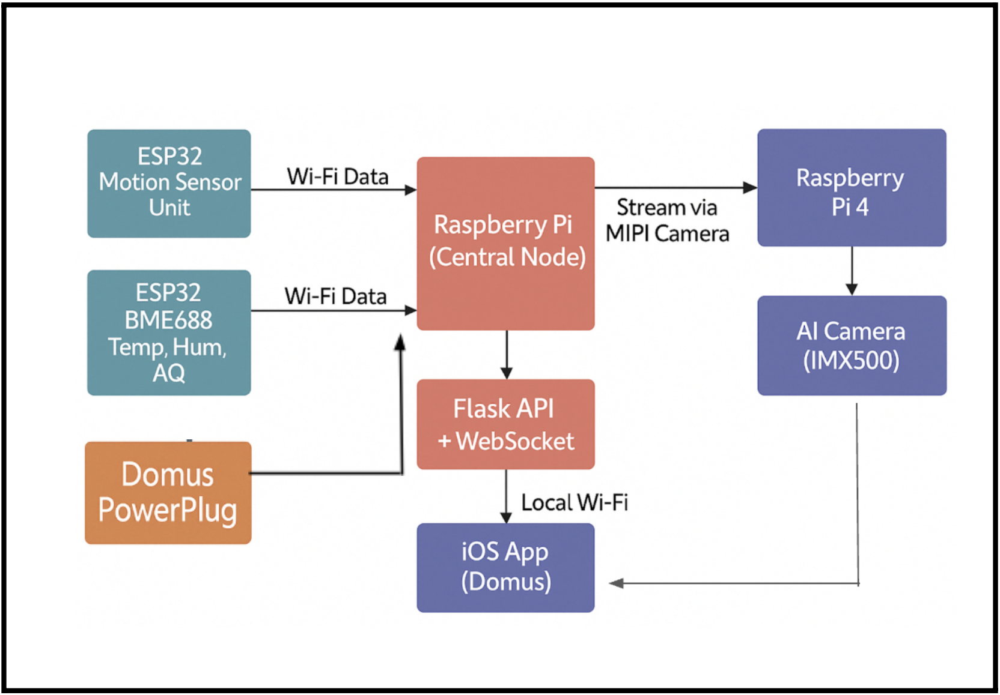
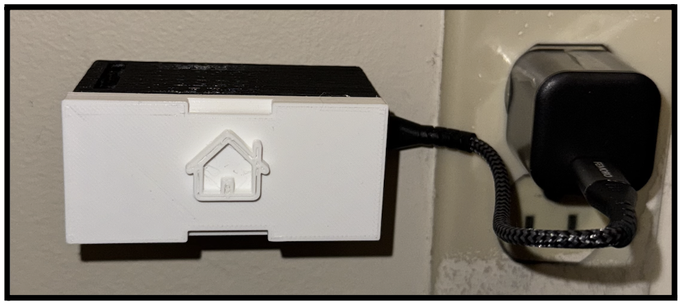
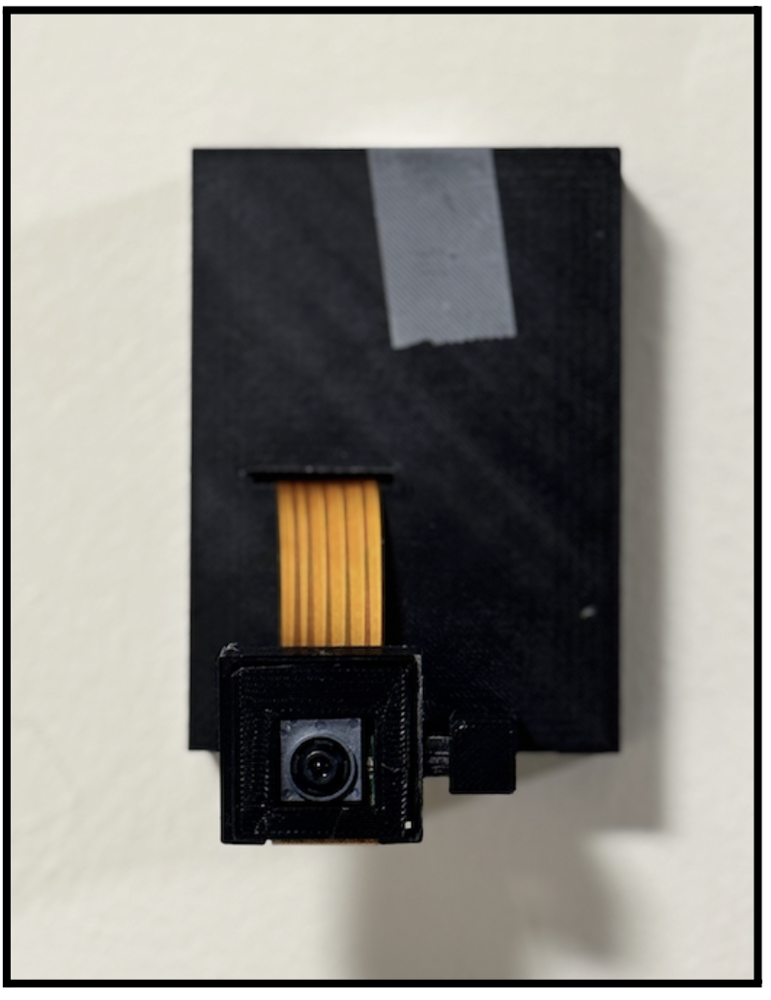
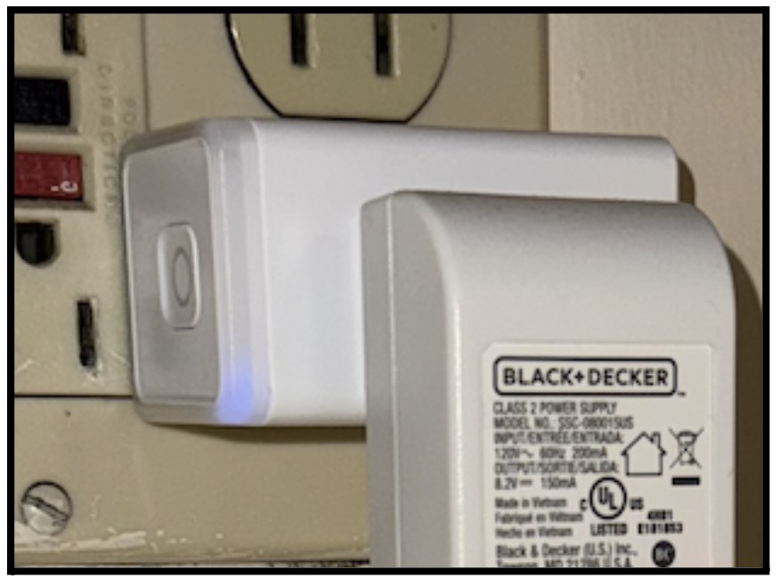
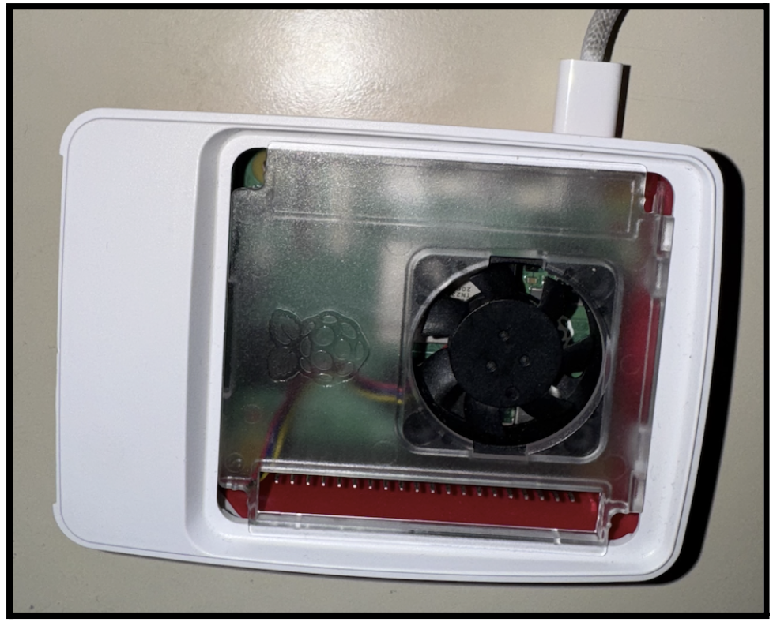
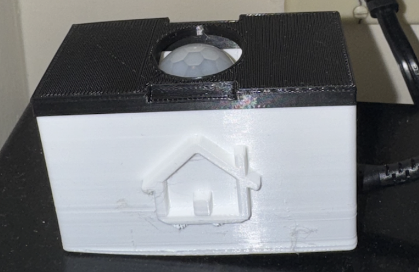

# Domus Smart Home — Hardware Documentation

**EC464 Senior Design Project**  
**Boston University, Team 27**

---

## 1. Introduction / Overview of Hardware System

The Domus Smart Home system employs a network of hardware components to enable environmental sensing, energy monitoring, and vision-based security. Built on an edge-deployed architecture, the system ensures enhanced privacy and low-latency performance without cloud dependency.

### Key Hardware Components:
- ESP32 Microcontrollers: Motion detection and air quality sensing.
- Raspberry Pi 5: Central control unit.
- Raspberry Pi 4: Dedicated video processing (vision module).
- TP-Link KP115 Smart Plug: Real-time energy tracking and appliance control.
- IMX500 AI-Enabled Camera Module: Object detection and facial recognition.

All devices communicate over a local Wi-Fi network, providing seamless integration and reliable modular deployment.

---

## 2. System Diagram / Hardware Schematic

The system architecture, including sensor nodes, camera module, and smart plug integration, is illustrated below:

---

## 3. Photos of Physical Hardware Modules

### Domus Hardware Modules

#### Domus EnvironSensor Module  

#### Domus Vision Module  

#### Domus Power Plug  

#### Domus Central Hub (Raspberry Pi 5)  

#### Domus Motion Sensor (HC-SR501)  

---

## 4. Vendor Information Table

| Component                      | Vendor        | Notes                                 |
|----------------------------------|---------------|---------------------------------------|
| Raspberry Pi 5                  | Amazon        | 8GB RAM version                      |
| Raspberry Pi 4B                 | Amazon        | 4GB RAM, used for camera processing  |
| ESP32 Microcontroller           | Amazon        | Two units, DevKitC boards            |
| BME688 Environmental Sensor     | Amazon        | Connected to ESP32                   |
| HC-SR501 Motion Sensor          | Amazon        | PIR-based motion detection           |
| TP-Link KP115 Smart Plug        | Amazon        | Energy tracking & appliance control  |
| Raspberry Pi AI Camera (IMX500) | Adafruit      | Vision module (IMX500 sensor)        |
| Raspberry Pi 5 Case             | Amazon        | Official Raspberry Pi case           |
| USB-C Cables / Adapters         | Amazon        | Power and data cables                |

---

## 5. Technical Specifications (from User Manual)

| Module                | Description                                      | Specification                         |
|-----------------------|--------------------------------------------------|----------------------------------------|
| Domus EnvironSensor   | Environmental sensing (BME688 via ESP32)         | ±0.5°C temp, ±3% RH, ±1 hPa pressure, AQI from gas resistance |
| Domus MotionSensor    | Motion detection (HC-SR501)                      | 7-meter range, 120° FOV, ~1s latency   |
| Domus Vision Module   | Object detection & face recognition (IMX500)     | MobileNet SSD V2, dlib face matching, ~20 FPS |
| Domus Power Plug      | Energy tracking & control (TP-Link KP115)        | ±5% accuracy, 15A/1800W max load       |
| Domus App Interface   | Mobile control and monitoring (React Native iOS) | Google login, live graphs, plug control, alerts |
| Domus Central Hub     | Raspberry Pi 5 (Flask server, APIs, SQLite DB)   | Quad-core ARM Cortex-A76, 8GB RAM, HTTP + WebSocket APIs |
| Communication System  | Wi-Fi connectivity                               | IEEE 802.11, HTTP/1.1, WebSocket, mDNS |

---

## 6. Assembly / Setup Instructions

### Hardware Setup Instructions:

1. **Prepare Power Sources:**
   - Use USB-C adapters for Raspberry Pi 5 and Raspberry Pi 4.
   - Plug ESP32 sensor nodes into wall sockets.
   - Ensure TP-Link Smart Plug is connected to a reliable power outlet.

2. **Sensor and Module Placement:**
   - **Motion Sensor:** Near doorways, main hallway.
   - **EnvironSensor:** Away from heat/cooling sources for accurate readings.
   - **Camera Module:** Securely mount facing entry points.

3. **Camera Setup:**
   - Connect the IMX500 AI camera to Raspberry Pi 4 via MIPI interface.
   - Confirm stable attachment and orientation.

4. **Power On Sequence (Important):**
   - Turn on **Raspberry Pi 5 first** (central hub).
   - Then power on Raspberry Pi 4 and ESP32 sensor nodes.
   - Last, activate the Smart Plug.

5. **Initial Device Pairing via App:**
   - Open Domus iOS app (TestFlight deployment).
   - Login with Google.
   - Use the “Devices” screen to discover and pair sensors.
   - Confirm pairing success via status indicators.

---

## 7. Datasheets / References

- [Raspberry Pi 5 Product Brief](https://datasheets.raspberrypi.com/rpi5/raspberry-pi-5-product-brief.pdf)
- [Raspberry Pi 4 Model B Datasheet](https://datasheets.raspberrypi.com/rpi4/raspberry-pi-4-datasheet.pdf)
- [ESP32 Datasheet](https://www.espressif.com/sites/default/files/documentation/esp32_datasheet_en.pdf)
- [BME688 Sensor Datasheet](https://www.bosch-sensortec.com/media/boschsensortec/downloads/datasheets/bst-bme688-ds001.pdf)
- [HC-SR501 Motion Sensor Datasheet](https://www.mpja.com/download/31227sc.pdf)
- [TP-Link KP115 Smart Plug Product Page](https://static.tp-link.com/2020/202010/20201030/KP115%28US%291.0%20%26%201.8_Datasheet.pdf)
- [Sony IMX500 Camera Overview](https://www.sony-semicon.com/en/products/IS/imx500.html)

---

*End of README_HARDWARE.md*

